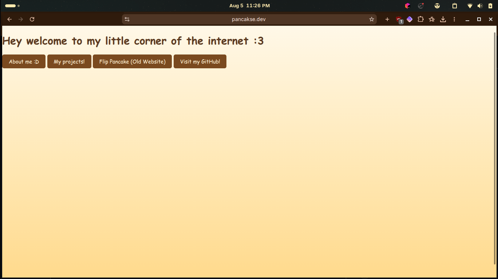

<div align="center">
  

# website
My own website :3
</div>

Link: https://pancakse.dev/

## About this Website
It was designed to be pancake themed and easy to navigate.

## What this website includes
- Flip a pancake
- Some information about me!
- My projects
- A link to my github!

## Techstack
- HTML
- CSS
- JavaScript

## How to run from source! (why would someone need to see this)
1. Clone the repo
```bash
git clone https://github.com/ItzPancakse/website.git
```

2. Open index.html in your browser


